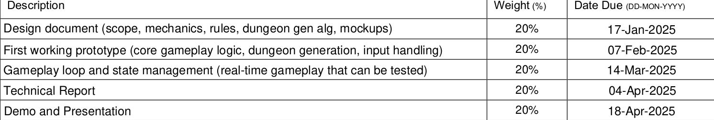

This document is designed as a means to assist the developer for the order in which they should tackle the project.

**Notice:** The core file structure and initial template of this document were generated with the assistance of Google Gemini 2.0 Flash Thinking Experimental.

 

<body>
    <h1>Project Course Outline</h1>
    
</body>

**Phase 1: Planning and Design (Due: 17-Jan-2025 - 20% Weight)**

*   **Deliverable:** Design Document
*   **Tasks:**
    *   **Game Scope Definition:**
        *   Define the core gameplay loop.
        *   Determine the number of dungeon levels and the level of complexity.
        *   Establish what elements (characters, items, enemies) will exist in the world
    *   **Game Mechanics Specification:**
        *   Define the rules of the game, including movement, combat, and any special abilities.
        *   Determine how the player will interact with the game world
    *   **Dungeon Generation Algorithm Selection:**
        *   [x] Research and choose the dungeon generation algorithm (random walk, cellular automata, or similar).  
        *   Plan how the algorithm will be implemented within the game. 
    *   **Mockup Creation:**
        *   Create basic mockups (using graph paper, or other simple method) showing the appearance of the game, especially basic tiles and the UI.
        *   Design for user interaction.

**Phase 2: Core Gameplay Prototype (Due: 07-Feb-2025 - 20% Weight)**

*   **Deliverable:** First Working Prototype
*   **Tasks:**
    *   **SFML Setup:**
        *   Set up a basic SFML project environment.
        *   Configure window and rendering.
    *   **Tile-based Rendering:**
        *   Implement basic tile rendering using SFML.
        *   Display basic tile graphics on the screen.
    *   **Dungeon Generation Implementation:**
        *   Implement the selected dungeon generation algorithm to create random layouts.
        *   Display these procedural generated dungeon layouts.
    *   **Input Handling:**
        *   Implement basic player movement controls.
    *   **Core Gameplay Loop:**
        *   Establish the main loop to handle events and game logic. 

**Phase 3: Gameplay Loop & State Management (Due: 14-Mar-2025 - 20% Weight)**

*   **Deliverable:** Tested and Functional Gameplay Loop
*   **Tasks:**
    *   **Game State Management:**
        *   Implement logic to manage the current game state, using object-oriented principles.
    *   **Gameplay Loop Enhancement:**
        *   Develop the full gameplay loop, including player movement, enemy interactions (basic if necessary), and basic game events.
    *   **Testing:**
        *   Ensure that the gameplay is testable and that the core functions are working.
	- Stretch Goals:
		-  Add any stretch goals at this point if you have the time.

**Phase 4: Documentation and Completion (Due: 04-Apr-2025 - 20% Weight)**

*   **Deliverable:** Technical Report
*   **Tasks:**
    *   **Write the Technical Report**
        *   Document in a professional style all the steps taken during the project
        *   Discuss solutions, challenges and successes
        *   Be clear and precise

**Phase 5: Demo and Presentation (Due: 18-Apr-2025 - 20% Weight)**

*   **Deliverable:** Demo and Presentation
*   **Tasks:**
    *   **Prepare Demo:**
        *   Fine-tune the project for demonstration.
        *   Create a short demo that shows the key functionality and mechanics.
    *   **Prepare Presentation Materials:**
        *   Create slides or notes for a presentation showcasing the project.
        *   Discuss the design, challenges, and results.
    *   **Present Project:**
        *  Clearly present the final product along with the project results.

**Notice:** This roadmap can and most likely will be adapted based on further learning and specific project requirements.
